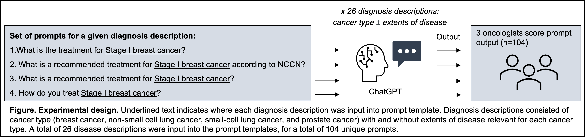

# ChatGPT_NCCN
Welcome to the Github repository for ChatGPT NCCN Evaluation! This project contains the code base, outputs, scoring guidelines, and annotations for evaluating the ChatGPT NCCN model's performance.

# Project Structure

This google drive folder contains the annotation/scoring guidelines, prompts, outputs from the turbo0301/ChatGPT, and the scoring records:
https://drive.google.com/drive/folders/1ClSynRGJqAcOhUkYQ9kJmcFAyqMPQWfa?usp=sharing

# Annotation Process

First, we generated designed four sets of prompts for breast, prostate and lung cancers among different stages. Then we ask turbo-0301 outputs for the given prompts using the ChatGPT NCCN model. 

After this, we asked four board-certified oncologists to evaluate the outputs based on a set of scoring guidelines. The scoring guidelines were designed to measure the quality of the responses based on factors such as relevance, coherence, and correctness.

# Diagrams

Below is a diagram showing the overall process of the ChatGPT NCCN evaluation:

# Findings/hightlights:

One-third of ChatGPT treatment recommendations were non-concordant with NCCN guidelines, and recommendations varied based on how the question was posed. There was frequent disagreement among annotators in scores, highlighting the ambiguities and challenges of evaluating generative LLM output. Also, all 4 prompt templates yielded the same scores for only 9/26 (34.6%) diagnoses.

# Conclusion:

Although the ChatGPT model shows promise in generating quality responses to given prompts. However, there is still much work to be done in terms of improving the model's correctness and robustness. And ChatGPT was more likely to provide at least one incorrect recommendation as opposed to no recommendation, a more insidious error that is difficult for non-experts to detect. 
We hope this research provides insight into areas of concern and needs for future research improvements to the ChatGPT model.

